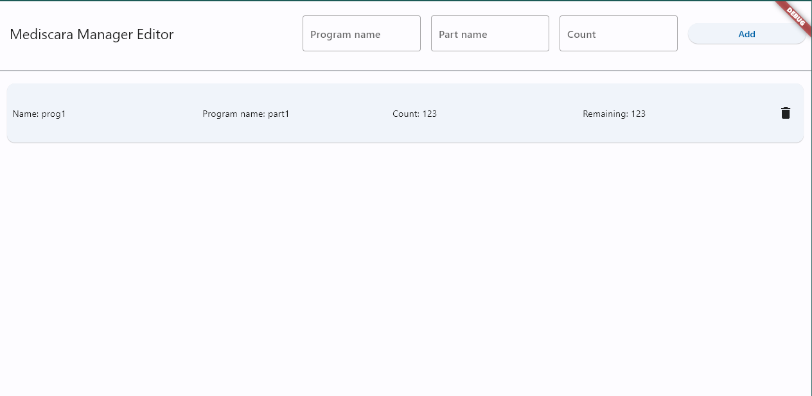

# Mediscara Manager Web Application

This software is part of the MediSCARA project's ROSE-AP platform.
It enables agile production at the shop-floor level by allowing a manager to pre-define the order and and magnitude of manufacturing.
The Mediscara Manager Web Application (MMWA) is built using the [Flutter](https://flutter.dev/) framework, therefore it is easily modifiable to suit every user's needs.

## Installation

First, install flutter. Steps for the installation can be found [here](https://docs.flutter.dev/get-started/install).
After the installation, the `flutter` command should work in the terminal.
Now the repository can be cloned.
After cloning, step into the `manager` directory and run the `flutter build web` command.
This will build the necessary *html* and *JavaScript* files to deploy the application to a server.

### Configuration

The behavior of the application can easily be modified using the `.env` file to set various environment variables.

| Variable name         | Description                       | Example               |
| --------------------- | -----------------------------     | --------------------- |
| KEYROCK_URL           | The url of the IDM                | http://localhost:8088 |
| OCB_URL               | The url of the OCB                | http://localhost:1026 |
| ROLE_MANAGER          | The role name assigned to manager | Manager               |
| ROLE_USER             | The role name assigned to user    | User                  |

## Usage

When the user visits the landing page, a login screen is presented to them.
Here then can enter their credentials.


After successfully logging in, the user can view the Collaborative and Industrial robotic cell editors.





Here the user can see all the entities in the manufacturing queue.
The entities are ordered such as the topmost entity will be processed first.
The user can also delete any entity from the queue.

---

## How it works

The authentication process uses the [KeyRock Identity Manager](https://fiware-idm.readthedocs.io/en/latest/).
If the login was successful, they can view the editor pages.
In these pages, the user can add or remove elements to the manufacturing queue.

### Manufacturing Queue

The manufacturing queue is a type of object represented via the [NGSI v2](https://fiware-orion.readthedocs.io/en/1.13.0/user/walkthrough_apiv2/index.html) data structure in a running [Orion Context Broker](https://fiware-orion.readthedocs.io/en/master/) container.

In this project, the collaborative and industrial robotic cells have their own manufacturing queues. These have their respective subtypes (`ManufacturingQueueItem.Collaborative` and `ManufacturingQueueItem.Industrial`).
The entities are ordered by their creation date attribute. This means that the `id`'s of these entities can be randomly generated.

An example entity of the Collaborative robotic cell:
``` json
{
        "id": "5460af40-3a5f-11ed-b86d-ab862784c2a8",
        "type": "ManufacturingQueueItem.Collaborative",
        "count": {
            "type": "Number",
            "value": 123,
            "metadata": {}
        },
        "name": {
            "type": "Text",
            "value": "prog1",
            "metadata": {}
        },
        "part": {
            "type": "Text",
            "value": "part1",
            "metadata": {}
        },
        "remaining": {
            "type": "Number",
            "value": 123,
            "metadata": {}
        }
    }
```

## Modifications

The [Dart](https://dart.dev/) language can be easily learned and is very robust.
The UI elements can be easily modified to fit multiple SME's needs.
In the project stucture the `login.dart` contains the login widget, from which after a successful login the `content.dart` widget is shown.
This contains the different pages of the layout, which are in the `collaborative` and `industrial` directories, respectively.

In the `models` directory, implementations can be found to interface with the OCB (`ngsiv2.dart`), model the Manufacturing Queue items (`queue_item.dart`) and to model the roles and users in the IDM (`role.dart` and `user.dart`).

In the services directory, implementations can be found to authenticate using the KeyRock IDM (`auth.dart`) and to make CRUD operations to the Orion Context Broker (`ocb.dart`).

> These implementations can all be easily modified to fit the different needs of the end user